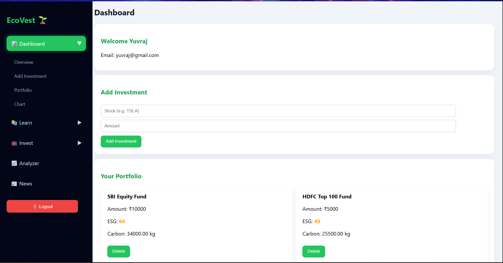
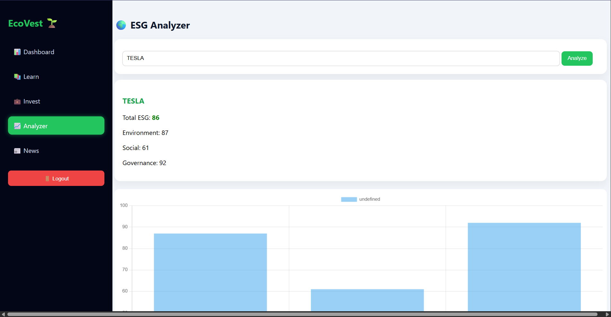
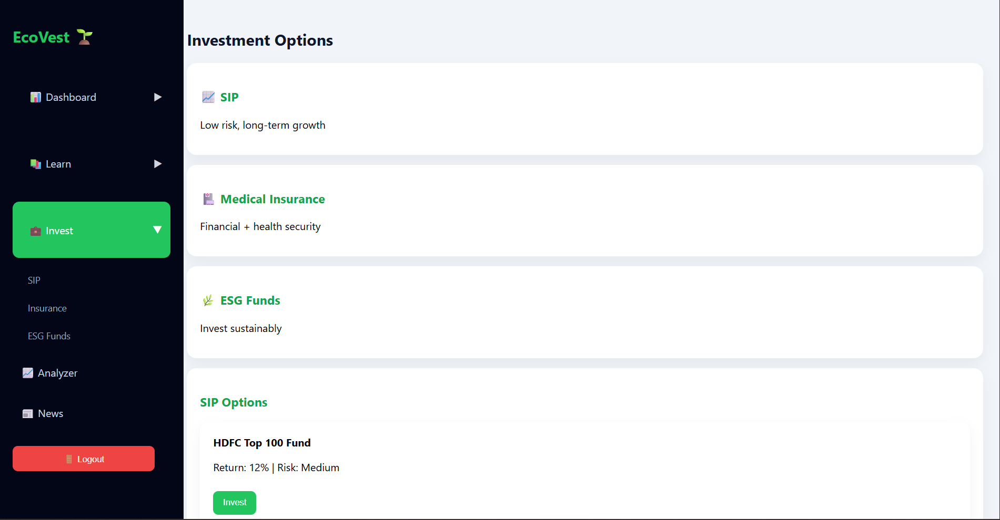
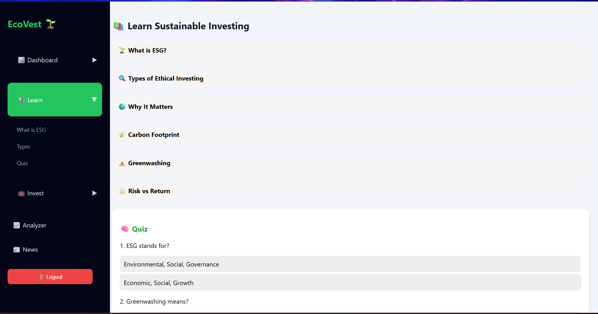

# 🌱 EcoVest – Sustainable Investment Platform

  <b>Invest Smart. Invest Sustainable.</b> 🌍  

  A full-stack web application that empowers users to make <b>ethical, data-driven investment decisions</b> using ESG analysis.

---

## 📌 📖 Project Overview

EcoVest is a full-stack sustainable investment platform designed to help users invest responsibly by considering ESG (Environmental, Social, Governance) factors.

Unlike traditional platforms that focus only on financial returns, EcoVest combines sustainability with investment decisions by integrating ESG analysis, portfolio tracking, investment options, and real-time financial news.

---

## ✨ Features

### 🔐 Authentication
- Secure Login & Registration  
- Session handling using localStorage  

### 📊 ESG Analyzer
- Analyze companies using ESG scores  
- Visualize data with interactive charts (Chart.js)  

### 💼 Investment Options
- SIP (Systematic Investment Plans)  
- Medical Insurance Plans  
- ESG Funds  

### 📈 Portfolio Management
- Add investments  
- Delete investments  
- View ESG score & carbon impact  

### 📰 Smart News Feed
- Real-time ESG + Finance news  
- Powered by GNews API  

### 📚 Learn Section
- ESG concepts explained  
- Accordion UI  
- Interactive quiz with score & progress bar  

### 🧭 UI/UX
- Sidebar navigation system  
- Dropdown menus with animation  
- Smooth scrolling and transitions  

---

## 🧠 Tech Stack

### 💻 Frontend
- HTML5  
- CSS3  
- JavaScript  

### ⚙️ Backend
- Node.js  
- Express.js  

### 🗄️ Database
- MongoDB  

### 📊 Libraries & APIs
- Chart.js  
- GNews API  

---

## 🏗️ System Architecture

EcoVest follows a 3-tier architecture:

1. Frontend handles UI and user interaction  
2. Backend processes logic and API handling  
3. Database stores user and investment data  

---

## 🧩 Project Modules

- Authentication module for user login and signup  
- ESG analyzer module for score calculation and visualization  
- Investment module for displaying available plans  
- Portfolio module for managing investments  
- News module for fetching real-time updates  
- Learning module for ESG awareness and quizzes  

---

## 🔌 APIs Used

### Internal APIs
- `/api/auth` – user authentication  
- `/api/portfolio` – manage investments  
- `/api/esg` – ESG analysis  

### External API
- GNews API for real-time ESG and financial news  

---

## ⚙️ Installation & Setup

### Clone the Repository

### Install Dependencies

### Run the Server

---

## 📸 Application Screenshots

### 🌐 Landing Page

### 🏠 Dashboard

### 📊 ESG Analyzer

### 💼 Investment Page

### 📚 Learn Section

---

## 🌍 What is ESG?

- Environmental – climate impact and sustainability  
- Social – employee welfare and diversity  
- Governance – ethics and transparency  

ESG helps investors evaluate companies beyond just profit.

---

## 🎯 Project Motivation

The project was developed to promote responsible investing by combining financial growth with environmental and social awareness.

It encourages users to make informed decisions that align with long-term sustainability goals.

---

## ⚠️ Challenges Faced

- Integrating real-time API data efficiently  
- Maintaining clean UI across multiple modules  
- Managing application state using Vanilla JavaScript  
- Structuring backend APIs properly  
- Ensuring smooth interaction between frontend and backend  

---

## 👥 Team Contributions

### **Yuvraj Yadav**
Worked on core analytical and backend components of the project. He developed the ESG analysis functionality, implemented portfolio handling logic, and contributed to the learning module. He also helped in building backend routes and ensuring smooth communication between frontend and database.

### **Siddhanthaditiyaa Vettakal**
Focused on user-facing components like the dashboard and authentication system. Designed and developed login and registration flows and implemented dynamic news fetching using APIs. Also ensured smooth navigation and better user experience across the application.

### **Dhwani Shetty**
Handled the investment and news-related features of the platform. Worked on displaying investment options and managing user portfolio interactions. Also contributed to connecting frontend components with backend APIs for seamless data updates.

### **Mayuresh Sangale**
Designed the overall user interface and layout of the application. Developed the landing page and handled styling across the platform. Also contributed to authentication and ESG-related scripts, ensuring both functionality and visual consistency.

---

## ⚠️ Limitations

- Basic authentication using localStorage  
- Limited real-time financial data  
- ESG data may not be fully accurate  
- No AI-based recommendations  

---

## 🚀 Future Enhancements

- JWT-based authentication  
- Integration of live stock market APIs  
- AI-based investment suggestions  
- Cloud deployment  
- Improved mobile responsiveness  

---

## 🏆 Highlights

- Full-stack implementation  
- Real-world use case  
- Clean and interactive UI  
- API integration  
- Data visualization  

---

## 👨‍💻 Author

Yuvraj Yadav  
Siddhanthaditiyaa Vettakal  
Dhwani Shetty  
Mayuresh Sangale  

---

## ⭐ Show Your Support

If you like this project:

Star the repository  
Fork it  
Share it  

---

## 💡 Final Thought

EcoVest is not just about investing money — it’s about investing in a better future.
